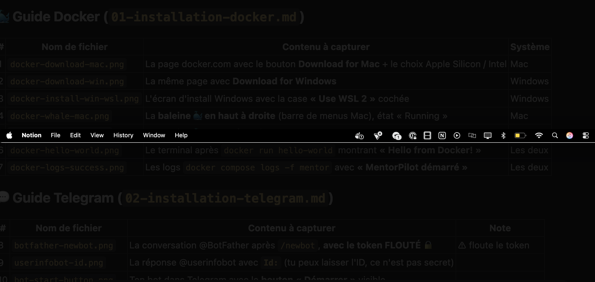
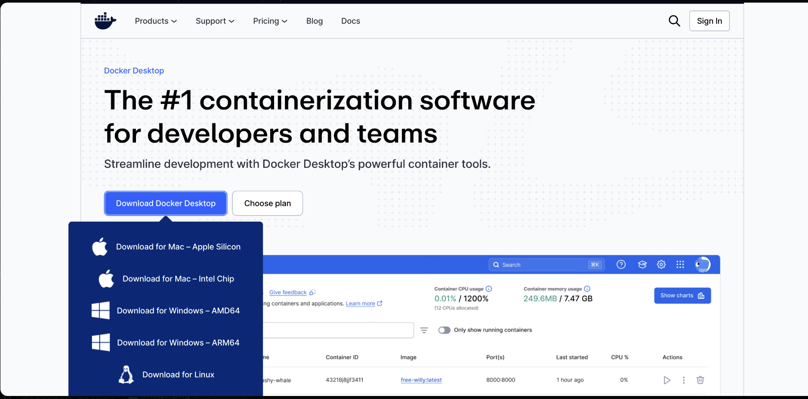
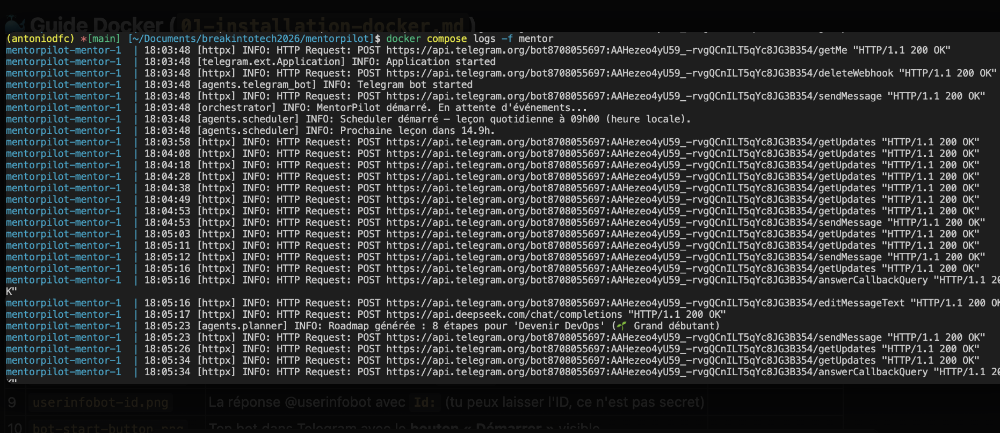

# 🐳 Guide 1 — Installer Docker

## Pourquoi ce guide ? (le but)

L'objectif de cette étape est de **préparer ta machine** pour faire tourner
l'application MentorPilot — **sans** avoir à installer Python, des librairies ou à
te battre avec des versions. Tu installes **un seul outil, Docker**, et à la fin
(étape 5) tu pourras **lancer tout le projet en une commande**. C'est la fondation :
les guides suivants (Telegram, GitHub) s'appuient dessus.

## C'est quoi Docker, en une phrase ?

Docker permet de lancer une application dans une **boîte isolée** (un « conteneur »)
qui contient déjà tout ce dont elle a besoin (la bonne version de Python, les
librairies…). Résultat : **tu n'installes pas Python toi-même**, tu n'as pas à te
soucier des versions, et « ça marche pareil sur toutes les machines ».

> Plus de détails dans le [glossaire → Docker / Image / Conteneur](04-glossaire.md#docker).

---

## 📟 D'abord : c'est quoi le « terminal » (la « CLI ») ?

Dans ce guide (et les suivants) tu verras souvent les mots **terminal**, **CLI** ou
**ligne de commande**. C'est **la même chose** : une fenêtre où, au lieu de cliquer
sur des boutons, tu **tapes une commande texte** (par ex. `docker --version`) puis tu
appuies sur **Entrée**. C'est l'outil standard pour piloter Docker, Git, etc.

> **CLI** = *Command Line Interface*, « interface en ligne de commande ». À l'opposé,
> une interface où tu cliques s'appelle une **GUI** (interface graphique).

**Comment l'ouvrir selon ton système :**

| Système | Application à ouvrir | Comment la trouver |
|---------|----------------------|--------------------|
| 🍎 **Mac** | **Terminal** | `Cmd + Espace`, tape « Terminal », puis `Entrée` |
| 🪟 **Windows** | **PowerShell** (ou *Terminal Windows*) | Menu Démarrer → tape « PowerShell » → `Entrée` |
| 🐧 **Linux** | **Terminal** | Raccourci `Ctrl + Alt + T`, ou cherche « Terminal » dans tes applis |

**Comment ça marche, concrètement :**

1. Tu **tapes** (ou copies-colles) une commande.
2. Tu appuies sur **Entrée** pour l'exécuter.
3. Le terminal **affiche le résultat** (ou une erreur) juste en dessous, puis attend
   la commande suivante. Une commande qui « ne dit rien » a souvent juste réussi.

> Quand une étape indique **« En CLI »**, ça veut simplement dire : « ouvre le
> terminal ci-dessus et tape la commande indiquée ». Détails dans le
> [glossaire → Terminal & Commande](04-glossaire.md#terminal-ou-ligne-de-commande).

---

> **Choisis ta section selon ton système :** [🍎 Mac](#-installation-sur-mac) ·
> [🪟 Windows](#-installation-sur-windows) · [🐧 Linux](#-installation-sur-linux).
> Une fois Docker installé, tout le monde se retrouve à la
> [section commune « Lancer MentorPilot »](#étape-5--lancer-mentorpilot-avec-docker).

---

# 🍎 Installation sur Mac

## Étape 1 (Mac) — Télécharger Docker Desktop

Va sur le site officiel : **https://www.docker.com/products/docker-desktop/**


Clique sur **Download for Mac** et choisis la bonne puce :

| Ton Mac | Quelle version ? |
|---------|------------------|
| Mac récent (2020+) — puce **Apple** (M1/M2/M3/M4) | **Apple Silicon** |
| Mac plus ancien — puce **Intel** | **Intel Chip** |

> **Comment savoir ?** Menu (en haut à gauche) → *À propos de ce Mac* →
> regarde la ligne « Puce » ou « Processeur ».

**En CLI** avec [Homebrew](https://brew.sh), tu peux tout faire en une commande
(elle télécharge **et** installe Docker Desktop) :

```bash
brew install --cask docker
```

## Étape 2 (Mac) — Installer

1. Ouvre le fichier `.dmg` téléchargé
2. Glisse l'icône **Docker** dans le dossier **Applications**
3. Ouvre **Docker** depuis le Launchpad ou le dossier Applications
4. Accepte les conditions, laisse les réglages par défaut (« Use recommended settings »)
5. Tu peux **passer/skip** la création de compte Docker — elle n'est pas nécessaire ici

## Étape 3 (Mac) — Vérifier que la baleine est allumée 🐳

En **haut à droite** de l'écran (la barre de menus), une **petite baleine** apparaît.

- 🐳 **Baleine fixe** → Docker est prêt
- 🐳 **Baleine qui s'anime** → Docker démarre encore, patiente 30 s



Ton terminal : **Terminal** (cherche « Terminal » dans Spotlight avec `Cmd + Espace`).

Passe directement à l'[Étape 4 — Vérifier dans le terminal](#étape-4--vérifier-dans-le-terminal-tous-systèmes).

---

# 🪟 Installation sur Windows

> ⚠️ **Prérequis Windows** : Windows 10/11 **64 bits**, et la
> **virtualisation activée** dans le BIOS (c'est le cas par défaut sur la
> plupart des PC récents). Docker Desktop installe **WSL 2** automatiquement
> (voir [glossaire → WSL 2](04-glossaire.md#wsl-2-windows)).

## Étape 1 (Windows) — Télécharger Docker Desktop

Va sur **https://www.docker.com/products/docker-desktop/** et clique sur
**Download for Windows** (`Docker Desktop Installer.exe`).



**En CLI** avec **winget** (inclus dans Windows 10/11), dans PowerShell :

```powershell
winget install --id Docker.DockerDesktop -e --source winget
```

## Étape 2 (Windows) — Installer

1. Lance **`Docker Desktop Installer.exe`**
2. Quand il le propose, **laisse coché** « Use WSL 2 instead of Hyper-V » (recommandé)

<!-- À insérer plus tard :  -->

3. Termine l'installation, puis **redémarre ton PC** si on te le demande
4. Au premier lancement, si Docker affiche un message demandant une mise à jour
   du **noyau WSL 2**, clique sur le lien proposé ou exécute dans PowerShell :
   ```powershell
   wsl --update
   ```
5. Accepte les conditions ; tu peux **passer** la création de compte Docker

## Étape 3 (Windows) — Vérifier que la baleine est allumée 🐳

En **bas à droite** (la zone de notification, près de l'horloge), clique sur la
flèche `^` pour voir les icônes cachées : une **petite baleine** 🐳 doit y être.

- 🐳 **Baleine fixe** → Docker est prêt
- 🐳 **Baleine animée** → patiente que ça démarre

<!-- À insérer plus tard :  -->

Ton terminal : ouvre **PowerShell** (menu Démarrer → tape « PowerShell ») ou le
**Terminal Windows**. Les commandes `docker ...` sont identiques à celles du Mac.

> Sur Windows, ouvre Docker Desktop **avant** de taper des commandes Docker.

Passe à l'[Étape 4 — Vérifier dans le terminal](#étape-4--vérifier-dans-le-terminal-tous-systèmes).

---

# 🐧 Installation sur Linux

**En CLI**, le plus simple est le script officiel de Docker (Ubuntu, Debian, Fedora…) :

```bash
# Installe Docker Engine + Docker Compose
curl -fsSL https://get.docker.com | sh

# (Recommandé) pouvoir lancer docker sans sudo : ajoute ton utilisateur au groupe docker
sudo usermod -aG docker $USER
# puis DÉCONNECTE/RECONNECTE ta session pour que ce soit pris en compte
```

> ⚠️ Sur Linux on installe en général **Docker Engine** (en ligne de commande, sans
> interface). C'est suffisant pour ce projet : les commandes `docker compose ...` sont
> identiques à celles du Mac et de Windows.

*(Alternative avec interface graphique — Docker Desktop pour Linux :
https://docs.docker.com/desktop/install/linux/. Détail du moteur seul :
https://docs.docker.com/engine/install/.)*

---

## Étape 4 — Vérifier dans le terminal *(tous systèmes)*

**But de l'étape :** s'assurer que Docker est **bien installé et fonctionnel**
*avant* de lancer le vrai projet. Deux contrôles : 1) la commande `docker` est
reconnue, 2) Docker sait réellement télécharger et exécuter un conteneur. Si ces
deux-là passent, l'étape 5 marchera.

Dans ton terminal (Terminal sur Mac, PowerShell sur Windows), tape :

```bash
docker --version
```

Tu dois voir quelque chose comme :

```
Docker version 27.x.x, build xxxxxxx
```

Puis teste que tout fonctionne réellement :

```bash
docker run hello-world
```

Si tu vois **« Hello from Docker! »**, tout est bon.


> `docker run` = « télécharge et lance un conteneur ». Voir le
> [glossaire → commandes Docker](04-glossaire.md#commandes-docker-utiles).

---

## Étape 5 — Lancer MentorPilot avec Docker

**But de l'étape :** c'est ici que Docker sert vraiment. La commande ci-dessous
**construit l'application** (à partir du `Dockerfile`) puis **la démarre** dans un
conteneur, en arrière-plan. À partir de là, ton mentor IA tourne sur ta machine.

> ℹ️ Cette étape suppose les deux autres guides déjà faits : le repo **cloné**
> (voir [guide GitHub](03-github-compte-et-clone.md)) et le fichier `.env` **rempli**
> avec tes clés (voir [guide Telegram](02-installation-telegram.md)). Sans eux, l'app
> démarrera mais ne pourra pas se connecter.

Une fois ces prérequis en place :

```bash
cd mentorpilot
docker compose up -d --build
```

- `cd mentorpilot` → entre dans le dossier du projet
  *(Windows : si tu as cloné dans `Documents`, le chemin complet ressemble à
  `cd C:\Users\TonNom\Documents\breakintotech2026\mentorpilot`)*
- `docker compose up` → construit et démarre l'app
- `-d` → en arrière-plan (« detached »), tu récupères ton terminal
- `--build` → (re)construit l'image à partir du `Dockerfile`

Pour **voir les logs** (ce que fait l'app en direct) :

```bash
docker compose logs -f mentor
```

*(`Ctrl + C` pour arrêter de regarder les logs — ça n'arrête PAS l'app.)*



Pour **arrêter** l'app :

```bash
docker compose down
```

---

## Problèmes fréquents

| Symptôme | Système | Cause | Solution |
|----------|---------|-------|----------|
| `Cannot connect to the Docker daemon` | Tous | Docker n'est pas lancé | Ouvre l'application Docker Desktop, attends la baleine 🐳 |
| `command not found: docker` / `docker n'est pas reconnu` | Tous | Installation incomplète / terminal pas relancé | Ferme et rouvre le terminal ; vérifie que Docker Desktop est installé |
| L'app redémarre en boucle avec une erreur de token | Tous | Tu as modifié `.env` après le démarrage | `docker compose up -d --force-recreate` (recharge le `.env`) |
| `port is already allocated` | Tous | Un autre programme utilise le même port | `docker compose down` puis relance |
| `WSL 2 installation is incomplete` | 🪟 Windows | Noyau WSL 2 manquant ou à mettre à jour | Lance `wsl --update` dans PowerShell, puis relance Docker Desktop |
| `Virtualization is not enabled` | 🪟 Windows | Virtualisation désactivée dans le BIOS | Active « Virtualization / SVM / VT-x » dans le BIOS de ton PC |
| `Hardware assisted virtualization ... not enabled` | 🪟 Windows | Idem (souvent sur PC fixe) | Même solution : activer la virtualisation dans le BIOS |

> **À retenir** : après chaque modification du fichier `.env`, il faut
> **recréer** le conteneur pour qu'il relise les nouvelles valeurs :
> ```bash
> docker compose up -d --force-recreate
> ```

➡️ **Suite : [Installer & configurer Telegram](02-installation-telegram.md)**
