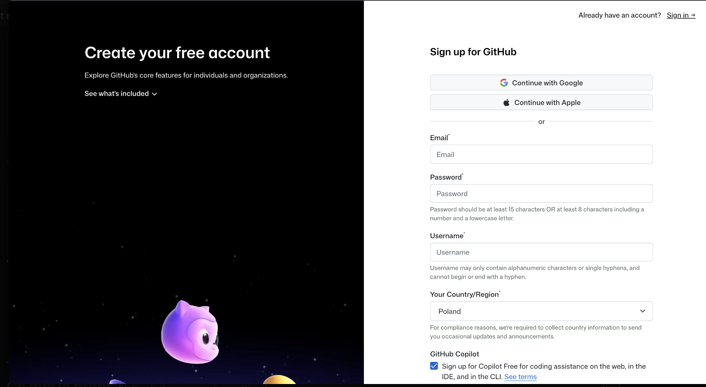
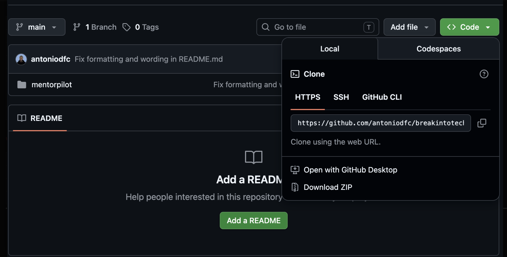
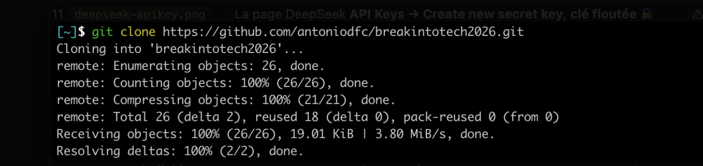

# Guide 5 — GitHub : créer un compte et cloner le repo (dans Ubuntu)

> ✅ **Où on en est :** ta **VM Ubuntu** est installée et à jour (guides
> [1 à 4](01-prerequis-materiel.md)). À partir d'ici, **tout se fait dans Ubuntu** :
> les commandes se tapent dans le **terminal d'Ubuntu** (`Ctrl + Alt + T`).

## C'est quoi GitHub ?

**GitHub** est un site web où l'on **stocke et partage du code**. Chaque projet y vit
dans un **dépôt** (en anglais « repository », souvent abrégé **repo**). C'est aussi une
sauvegarde en ligne et un historique de toutes les modifications.

- **Git** = l'outil (dans ton Ubuntu) qui suit les versions du code.
- **GitHub** = le site web qui héberge le code en ligne.

> Voir le [glossaire → Git / GitHub / Repo / Cloner](08-glossaire.md#git).

---

## Étape 1 — Créer un compte GitHub



1. Va sur **https://github.com** et clique sur **Sign up**.
2. Renseigne :
   - une **adresse email**
   - un **mot de passe** solide
   - un **username** (nom d'utilisateur public, ex : `antoniodfc`)
3. Valide le petit puzzle de vérification.
4. Confirme ton email via le lien reçu dans ta boîte mail.
5. À la question du plan, choisis **Free** (gratuit, amplement suffisant).

Ton compte est prêt.

---

## Étape 2 — Installer Git dans Ubuntu

Pour **cloner** (télécharger) un repo, tu as besoin de l'outil **git**.

> 📟 **Pas sûr de ce qu'est le « terminal » / la « CLI » ?** C'est la fenêtre où tu
> tapes des commandes, ouverte au [guide précédent](04-installer-vm-ubuntu.md)
> (`Ctrl + Alt + T`). Détails dans le
> [glossaire → Terminal](08-glossaire.md#terminal-ou-ligne-de-commande).

D'abord, vérifie s'il n'est pas **déjà installé** (souvent le cas sous Ubuntu) :

```bash
git --version
```

- Si une version s'affiche (`git version 2.x.x`) → c'est déjà installé, **passe à
  l'étape 3**.
- Si tu obtiens `command not found` → installe-le avec **apt** (le gestionnaire de
  paquets d'Ubuntu) :

```bash
sudo apt update && sudo apt install -y git
```

- `sudo` → en administrateur (il demande ton mot de passe Ubuntu).
- `apt update` → rafraîchit la liste des paquets ; `apt install -y git` → installe Git.

### Vérifier l'installation

```bash
git --version
```

---

## Étape 3 — Se présenter à Git (une seule fois)

Dis à Git qui tu es (ça apparaîtra dans l'historique de tes futurs commits) :

```bash
git config --global user.name "Ton Nom"
git config --global user.email "ton.email@example.com"
```

> Utilise **la même adresse email** que ton compte GitHub.

---

## Étape 4 — Trouver l'adresse du repo à cloner

Sur la page GitHub du projet :

1. Clique sur le bouton vert **`<> Code`**.
2. Onglet **HTTPS** (le plus simple pour débuter).
3. Copie l'URL, qui ressemble à :
   ```
   https://github.com/antoniodfc/breakintotech2026.git
   ```



> **HTTPS vs SSH ?** HTTPS = simple, juste l'URL. SSH = plus avancé, nécessite
> de configurer une clé. **Commence par HTTPS.** Voir
> [glossaire → HTTPS / SSH](08-glossaire.md#https-vs-ssh).

---

## Étape 5 — Cloner le repo

**Cloner** = télécharger une copie complète du repo (code + historique) sur ton ordi.

1. Dans le terminal, place-toi là où tu veux ranger le projet, par exemple :
   ```bash
   cd ~/Documents
   ```
2. Lance le clonage :
   ```bash
   git clone https://github.com/antoniodfc/breakintotech2026.git
   ```
3. Entre dans le dossier créé :
   ```bash
   cd breakintotech2026
   ```



Tu as maintenant tout le code en local. Vérifie avec :

```bash
ls
```

Tu dois voir les dossiers du projet, dont `bitmentor/` et `material/`.

---

## Étape 6 — Mettre à jour plus tard

Quand le projet évolue sur GitHub, récupère les dernières modifications avec :

```bash
git pull
```

---

## (Bonus) Envoyer TES modifications sur GitHub

Si tu modifies le code et veux le sauvegarder en ligne :

```bash
git add .                       # prépare tous tes changements
git commit -m "Décris ton changement"   # enregistre une version
git push                        # envoie sur GitHub
```

> La toute première fois que tu fais `git push`, GitHub te demandera de
> t'authentifier. Le mot de passe classique ne marche plus : utilise un
> **Personal Access Token** (jeton). Voir
> [glossaire → Personal Access Token](08-glossaire.md#personal-access-token-pat).

> ⚠️ **Ne pousse jamais ton fichier `.env`** (il contient tes secrets). Il est déjà
> ignoré par le `.gitignore` du projet, donc tu es protégé.

---

## Problèmes fréquents

| Symptôme | Cause | Solution |
|----------|-------|----------|
| `command not found: git` | Git pas installé | Refais l'étape 2 |
| `Repository not found` | URL fausse, ou repo privé sans accès | Vérifie l'URL / tes droits d'accès |
| `Authentication failed` au `push` | Mot de passe au lieu d'un token | Crée un **Personal Access Token** et utilise-le |
| `Permission denied (publickey)` | Tu utilises une URL SSH sans clé configurée | Clone plutôt en **HTTPS** |

➡️ **Suite : [Installer Docker](06-installation-docker.md)**
