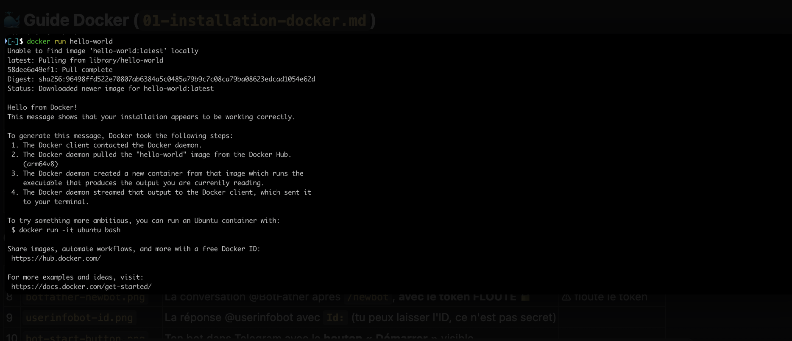

# 🐳 Guide 6 — Installer Docker (dans Ubuntu)

> ✅ **Où on en est :** tu travailles maintenant **dans ta VM Ubuntu** (guides
> [1 à 4](01-prerequis-materiel.md)) et tu as **cloné le projet**
> ([guide GitHub](05-github-compte-et-clone.md)). Toutes les commandes ci-dessous se
> tapent dans le **terminal d'Ubuntu** (`Ctrl + Alt + T`).

## Pourquoi ce guide ? (le but)

L'objectif est de **préparer Ubuntu** à faire tourner l'application BitMentor — **sans**
installer Python ni les librairies à la main. Tu installes **un seul outil, Docker**, et
à la fin (guide Telegram) tu lanceras **tout le projet en une commande**.

## C'est quoi Docker, en une phrase ?

Docker permet de lancer une application dans une **boîte isolée** (un « conteneur »)
qui contient déjà tout ce dont elle a besoin (la bonne version de Python, les
librairies…). Résultat : **tu n'installes pas Python toi-même**, tu n'as pas à te
soucier des versions, et « ça marche pareil sur toutes les machines ».

```
                  Ta VM Ubuntu
┌────────────────────────────────────────────────┐
│ Conteneur Docker — la « boîte » isolée          │
│ ┌────────────────────────────────────────────┐ │
│ │ BitMentor  → le code de l'application       │ │
│ │ Python     → déjà la bonne version          │ │
│ │ Librairies → déjà installées                │ │
│ └────────────────────────────────────────────┘ │
└────────────────────────────────────────────────┘

  → Tu n'installes pas Python ni les librairies toi-même :
    tout est déjà DANS la boîte.
```

> Plus de détails dans le [glossaire → Docker / Image / Conteneur](08-glossaire.md#docker).

---

## Étape 1 — Installer Docker Engine

Sous Linux, on installe **Docker Engine** (Docker en ligne de commande, sans interface
graphique — c'est tout ce dont on a besoin). Le plus simple est le **script officiel**
de Docker. Dans le terminal Ubuntu :

```bash
curl -fsSL https://get.docker.com | sh
```

- `curl -fsSL …` → **télécharge** le script d'installation officiel.
- `| sh` → **l'exécute**. Il installe Docker Engine **et** Docker Compose.

L'installation prend 1–2 minutes et demandera ton **mot de passe** (celui de ta session
Ubuntu).

---

## Étape 2 — Utiliser Docker sans `sudo`

Par défaut, Docker exige `sudo` (les droits administrateur) à chaque commande. Pour t'en
passer, ajoute ton utilisateur au **groupe `docker`** :

```bash
sudo usermod -aG docker $USER
```

- `usermod -aG docker $USER` → ajoute **ton utilisateur** au groupe `docker`.

> ⚠️ **Cette ligne ne prend effet qu'après une reconnexion.** Le plus simple :
> **redémarre ta VM Ubuntu** (ou déconnecte/reconnecte ta session). Sinon, pour la
> session courante uniquement, tu peux taper `newgrp docker`.

---

## Étape 3 — Vérifier que Docker fonctionne

Après la reconnexion, vérifie la version :

```bash
docker --version
```

Tu dois voir quelque chose comme :

```
Docker version 27.x.x, build xxxxxxx
```

Puis teste que tout marche **réellement** :

```bash
docker run hello-world
```

Si tu vois **« Hello from Docker! »**, tout est bon. 🎉



> `docker run` = « télécharge et lance un conteneur ». Voir le
> [glossaire → commandes Docker](08-glossaire.md#commandes-docker-utiles).

---

## Étape 4 — (Référence) Lancer / arrêter le projet

⚠️ **Tu n'as pas besoin de lancer le projet maintenant** : il te manque encore tes
clés Telegram et DeepSeek. Le **premier lancement se fera à la fin du
[guide Telegram](07-installation-telegram.md)**, une fois ton `.env` rempli.

Garde ces commandes sous la main — tu les utiliseras à ce moment-là (et au quotidien),
toujours **depuis le dossier `bitmentor/`** (récupéré au
[guide GitHub](05-github-compte-et-clone.md)) :

```bash
cd bitmentor
docker compose up -d --build
```

- `cd bitmentor` → entre dans le dossier du projet.
- `docker compose up` → construit et démarre l'app.
- `-d` → en arrière-plan (« detached »), tu récupères ton terminal.
- `--build` → (re)construit l'image à partir du `Dockerfile`.

Pour **voir les logs** (ce que fait l'app en direct) :

```bash
docker compose logs -f bitmentor
```

*(`Ctrl + C` pour arrêter de regarder les logs — ça n'arrête PAS l'app.)*

Pour **arrêter** l'app :

```bash
docker compose down
```

---

## Problèmes fréquents

| Symptôme | Cause | Solution |
|----------|-------|----------|
| `permission denied while trying to connect to the Docker daemon` | Tu n'as pas (encore) rejoint le groupe `docker` | Refais l'étape 2 puis **redémarre la VM** |
| `command not found: docker` | Installation incomplète / terminal pas relancé | Refais l'étape 1, ferme et rouvre le terminal |
| `Cannot connect to the Docker daemon` | Le service Docker n'est pas démarré | `sudo systemctl start docker` (et `sudo systemctl enable docker` pour le démarrage auto) |
| `port is already allocated` | Un autre programme utilise le même port | `docker compose down` puis relance |
| L'app redémarre en boucle (erreur de token) | `.env` modifié après le démarrage | `docker compose up -d --force-recreate` (recharge le `.env`) |

> **À retenir** : après chaque modification du fichier `.env`, il faut **recréer** le
> conteneur pour qu'il relise les nouvelles valeurs :
> ```bash
> docker compose up -d --force-recreate
> ```

➡️ **Suite : [Installer & configurer Telegram](07-installation-telegram.md)**
