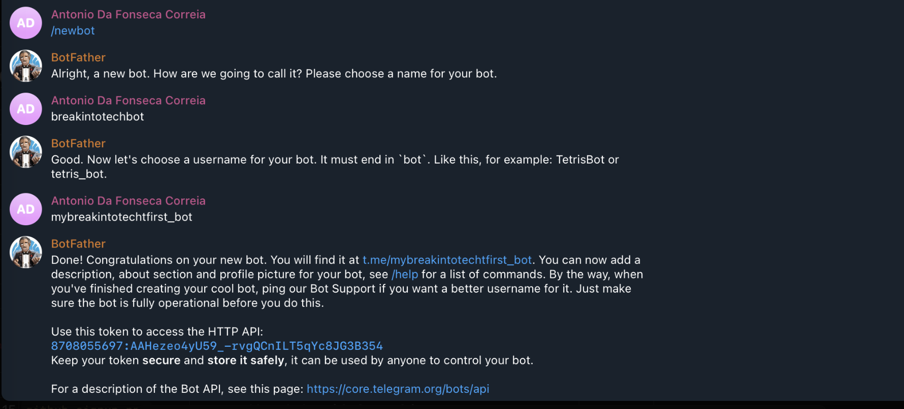
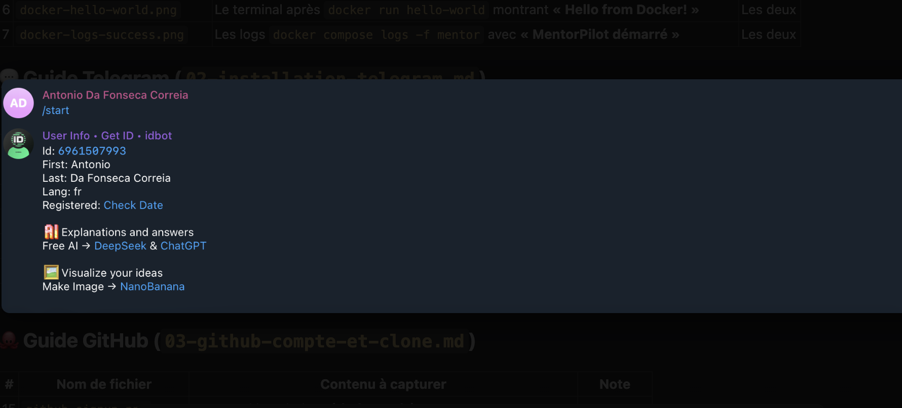
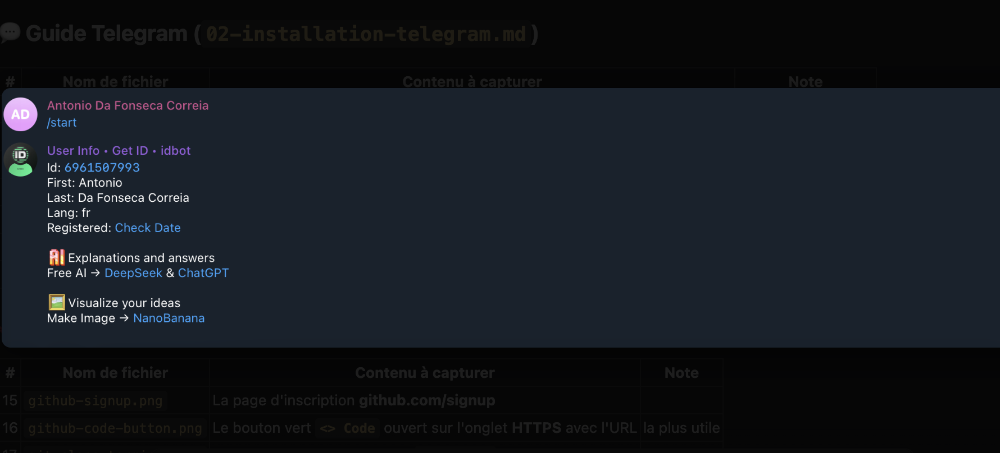
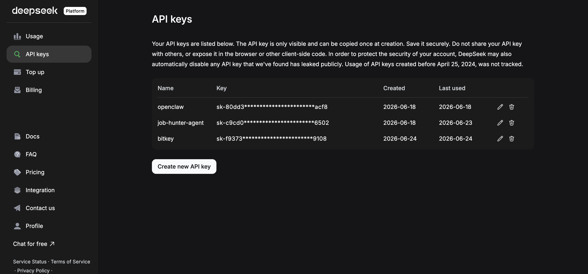
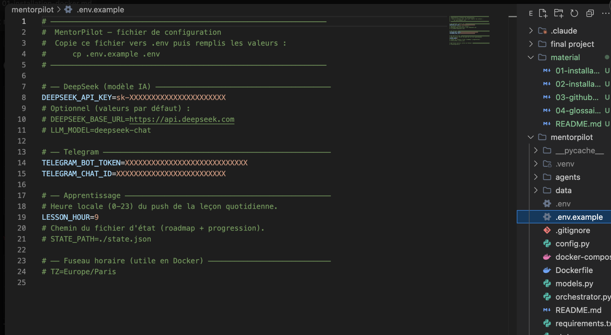
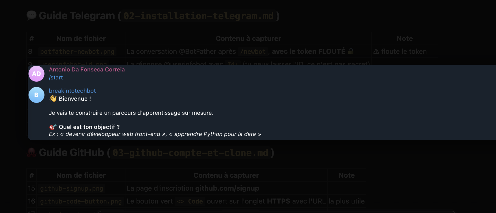

# Guide 2 — Installer Telegram et configurer ton bot

BitMentor te parle **via Telegram** : c'est ton interface. Tu vas créer un **bot**
(un compte automatisé piloté par le code) et récupérer **3 informations** à coller
dans le fichier `.env`.

À la fin de ce guide tu auras :

| Variable | Ce que c'est | Exemple de format |
|----------|--------------|-------------------|
| `TELEGRAM_BOT_TOKEN` | La clé secrète de ton bot | `8123456789:AAH...long...` |
| `TELEGRAM_CHAT_ID` | Ton identifiant perso (pour que le bot t'écrive) | `7042123456` |
| `DEEPSEEK_API_KEY` | La clé de l'IA qui rédige les leçons | `sk-...` |

> Un *token*, une *clé API* ? Voir le [glossaire](08-glossaire.md#token--cle-api).

---

## Étape 1 — Installer Telegram

1. Sur ton **téléphone** : installe **Telegram** depuis l'App Store (iPhone) ou
   le Play Store (Android), puis crée ton compte avec ton numéro.
2. *(Optionnel mais pratique)* installe aussi **Telegram Desktop** sur ton ordi :
   https://desktop.telegram.org — ça permet de copier-coller les clés facilement.

---

## Étape 2 — Créer ton bot avec @BotFather

**@BotFather** est le bot officiel de Telegram qui sert à créer d'autres bots.

1. Dans la barre de recherche Telegram, tape **`BotFather`** et ouvre celui avec la
   **coche bleue** (compte vérifié).
2. Clique sur **Démarrer** (ou envoie `/start`).
3. Envoie la commande :
   ```
   /newbot
   ```
4. Il te demande un **nom** (celui affiché en haut de la conversation). Ce nom **peut
   être le même pour tout le monde**, ex : `Mon Mentor IA`.
5. Puis un **username** (le `@…`) qui doit **finir par `bot`**.
   > ⚠️ **Ce username est unique dans tout Telegram** : personne d'autre ne peut avoir
   > le même. Rends-le **personnel** en y glissant ton prénom et/ou des chiffres —
   > ex : `mentor_julie_2026_bot`, `bitmentor_dupont07_bot`, `mentor_amine_bot`.
   > Si BotFather répond **« Sorry, this username is already taken »**, ajoute des
   > chiffres ou change un mot, et réessaie jusqu'à ce qu'il l'accepte.
6. BotFather te répond avec un message contenant ton **token** :
   ```
   Use this token to access the HTTP API:
   8123456789:AAHxxxxxxxxxxxxxxxxxxxxxxxxxxxxx
   ```



**Copie ce token** : c'est ton **`TELEGRAM_BOT_TOKEN`**.

> **Le username que tu as choisi n'a aucune importance pour le projet** : c'est ce
> **token** (unique à ton bot) qui identifie ton bot dans le code et le `.env`. Tu peux
> donc prendre le username que tu veux, du moment que BotFather l'accepte.

> ⚠️ **Ne partage JAMAIS ce token** publiquement. Quiconque l'a peut contrôler ton bot.
> Si tu le divulgues par erreur, renvoie `/revoke` à BotFather pour en générer un nouveau.

---

## Étape 3 — Récupérer ton `TELEGRAM_CHAT_ID`

Le bot a besoin de savoir **à qui** envoyer les messages : c'est ton *chat ID*.

**Méthode simple — @userinfobot :**

1. Cherche **`userinfobot`** dans Telegram et ouvre-le.
2. Envoie `/start`.
3. Il te répond avec tes infos, dont :
   ```
   Id: 7042123456
   ```



Le nombre après `Id:` est ton **`TELEGRAM_CHAT_ID`**.

> **Bon à savoir** : un ID de personne est un nombre **positif**.
> Pour un **groupe** il serait **négatif** (ex : `-1001234...`). Ici on utilise ton
> chat perso, donc un nombre positif.

---

## Étape 4 — Réveiller ton bot

Un bot Telegram **ne peut pas** écrire à quelqu'un en premier tant que cette personne
ne lui a pas parlé au moins une fois.

1. Dans Telegram, cherche le **username de TON bot** (ex : `mon_mentor_2026_bot`).
2. Ouvre-le et clique sur **Démarrer** (ou envoie n'importe quel message).



C'est tout — maintenant le bot a le droit de t'écrire.

---

## Étape 5 — Obtenir ta clé DeepSeek (l'IA)

C'est l'IA qui **rédige les roadmaps et les leçons**.

1. Va sur **https://platform.deepseek.com** et crée un compte (≈ 5 M de tokens
   offerts à l'inscription, largement suffisant pour tester).
2. Menu **API Keys** → **Create new secret key**.
3. **Copie** la clé immédiatement (format `sk-...`) — elle ne s'affiche qu'une fois.



C'est ta **`DEEPSEEK_API_KEY`**.

---

## Étape 6 — Remplir le fichier `.env`

Dans le terminal d'**Ubuntu**, place-toi dans le dossier `bitmentor/` et crée ton
fichier de configuration à partir du modèle :

```bash
cd bitmentor
cp .env.example .env
```

Ouvre ensuite `.env` pour le remplir. Le plus simple en ligne de commande, avec
l'éditeur **nano** :

```bash
nano .env
```

- Modifie les valeurs, puis enregistre avec **`Ctrl + O`** (puis `Entrée`) et quitte
  avec **`Ctrl + X`**.
- *(Tu peux aussi l'ouvrir avec l'éditeur de texte graphique d'Ubuntu : `gedit .env`.)*

Remplace les valeurs d'exemple par **tes vraies clés** :

```ini
DEEPSEEK_API_KEY=sk-ta_vraie_cle_deepseek
TELEGRAM_BOT_TOKEN=8123456789:AAH...ton_vrai_token
TELEGRAM_CHAT_ID=7042123456
LESSON_HOUR=9
TZ=Europe/Paris
```



- `LESSON_HOUR` = l'heure (0–23) où le bot t'envoie la leçon du jour. `9` = 9 h.
- `TZ` = ton **fuseau horaire**. ⚠️ **Important en Docker** : sans lui, le conteneur
  tourne en **UTC** et ta leçon arriverait à la mauvaise heure (décalée de 1–2 h).
  Mets ton fuseau, ex. `Europe/Paris`.

> ⚠️ **Le fichier `.env` ne doit jamais être partagé ni envoyé sur GitHub.**
> Bonne nouvelle : il est déjà protégé par le `.gitignore` du projet (voir
> [glossaire → .gitignore](08-glossaire.md#gitignore)).

---

## Étape 7 — Lancer BitMentor (le grand moment)

C'est **le premier lancement du projet**. Tout est prêt : le code est cloné
([guide GitHub](05-github-compte-et-clone.md)), Docker est installé
([guide Docker](06-installation-docker.md)) et ton `.env` est rempli (étape 6).

Depuis le dossier `bitmentor/` :

```bash
docker compose up -d --build
docker compose logs -f bitmentor
```

Tu dois voir dans les logs :

```
Telegram bot started
BitMentor démarré. En attente d'événements...
```

…et recevoir **« 🤖 BitMentor est en ligne ! »** dans ta conversation Telegram.

<!-- À insérer plus tard :  -->

Envoie alors **`/start`** à ton bot pour définir ton objectif et générer ta roadmap.



---

## Problèmes fréquents

| Symptôme | Cause | Solution |
|----------|-------|----------|
| `InvalidToken ... was rejected` | Token faux ou resté en placeholder | Recopie le vrai token, puis `docker compose up -d --force-recreate` |
| Le bot démarre mais ne t'écrit pas | Tu n'as pas « démarré » ton bot | Ouvre ton bot, clique **Démarrer** (étape 4) |
| `TELEGRAM_CHAT_ID manquant ou invalide` | ID vide ou non numérique | Remets le nombre donné par @userinfobot |
| Les leçons arrivent décalées de 1–2 h | `TZ` absent → conteneur en UTC | Ajoute `TZ=Europe/Paris` dans `.env`, puis `docker compose up -d --force-recreate` |
| Pas de leçon du tout à l'heure prévue | `LESSON_HOUR` invalide | Mets un entier 0–23 et recrée le conteneur |

> **Toujours bloqué après ces pistes ?** Déroule la
> [méthode de débogage (guide 9)](09-debugger-et-demander-de-laide.md) — lire l'erreur,
> chercher, bien demander à un LLM — puis écris-nous si besoin. Tu n'es jamais seul.

➡️ **Suite : [Glossaire débutant](08-glossaire.md)** — pour comprendre tous les mots du projet.
